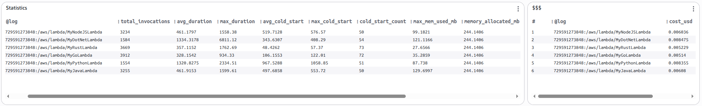
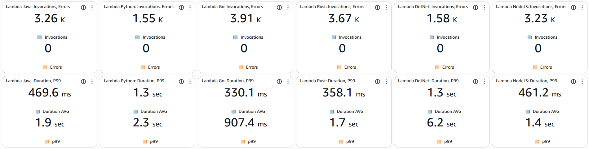
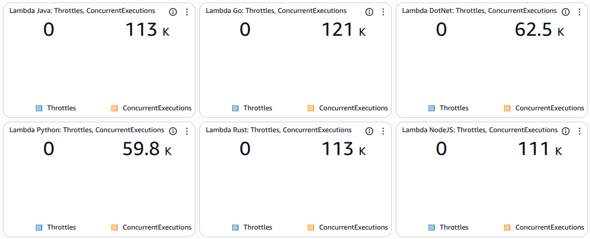
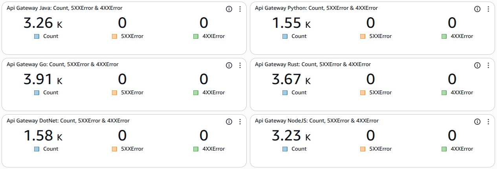
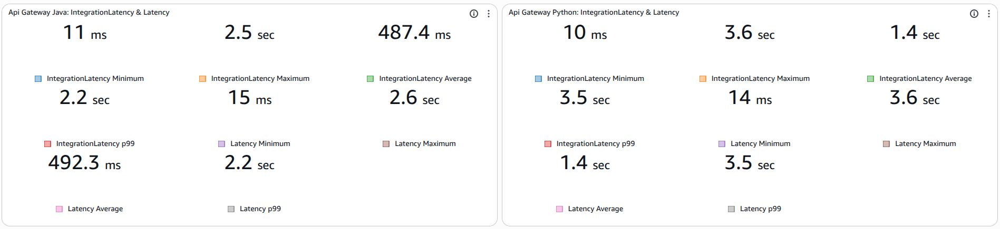
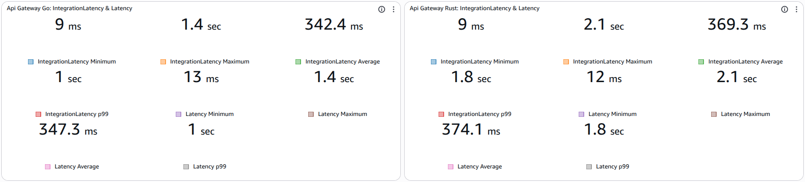
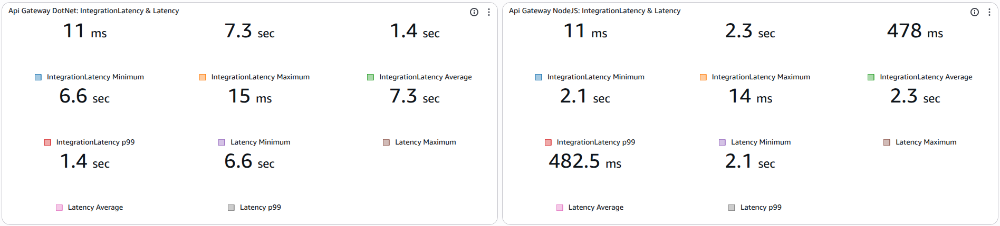

# AWS Lambdas Benchmark Project

Este repositório contém um projeto completo para comparar o desempenho de AWS Lambdas implementadas em **Java (Quarkus)**, **Python**, **Go**, **Rust**, **.NET** e **Node.js**. O projeto inclui a infraestrutura como código (Terraform), o código fonte das funções e uma ferramenta de benchmark.

## Estrutura do Projeto

A estrutura de diretórios é organizada da seguinte forma:

```
/
├── benchmark/      # Ferramenta de teste de carga escrita em Go
├── dotnet/         # Implementação da Lambda em .NET
├── go/             # Implementação da Lambda em Go
├── infra/          # Infraestrutura como código (Terraform)
├── java/           # Implementação da Lambda em Java (Quarkus)
├── nodejs/         # Implementação da Lambda em Node.js
├── python/         # Implementação da Lambda em Python
├── rust/           # Implementação da Lambda em Rust
└── README.md       # Documentação do projeto
```

---

## 1. Java (Quarkus)

A implementação Java utiliza o framework **Quarkus** para otimizar o tempo de inicialização e consumo de memória, ideal para ambientes Serverless.

*   **Localização:** `/java`
*   **Framework:** Quarkus 3.15.1
*   **Java Version:** 21
*   **Build Tool:** Maven

---

## 2. Python

A implementação Python é uma função Lambda padrão, utilizando bibliotecas leves para manter o cold start baixo.

*   **Localização:** `/python`
*   **Runtime:** Python 3.12
*   **Principais Dependências (`requirements.txt`):**
    *   `boto3`: SDK da AWS para interagir com DynamoDB.
    *   `PyJWT`: Manipulação de tokens JWT.
    *   `bcrypt`: Hashing de senhas.

---

## 3. Go

A implementação em Go é compilada para um binário nativo e executada no runtime `provided.al2`.

*   **Localização:** `/go`
*   **Runtime:** `provided.al2`
*   **Build:** O binário é compilado estaticamente com `CGO_ENABLED=0` para evitar problemas de compatibilidade com a `glibc`.
*   **Principais Dependências:**
    *   `github.com/aws/aws-lambda-go`: Runtime da AWS Lambda.
    *   `github.com/aws/aws-sdk-go`: SDK da AWS.
    *   `github.com/golang-jwt/jwt/v5`: Manipulação de JWT.
    *   `golang.org/x/crypto/bcrypt`: Hashing de senhas.

---

## 4. Rust

A implementação em Rust também é compilada para um binário nativo estático, visando máxima performance e segurança.

*   **Localização:** `/rust`
*   **Runtime:** `provided.al2`
*   **Build:** O binário é compilado para o target `x86_64-unknown-linux-musl` para garantir compatibilidade com o ambiente Lambda. O build é feito via Docker para não depender de ferramentas no host.
*   **Principais Dependências:**
    *   `lambda_runtime`: Runtime da AWS Lambda.
    *   `aws-sdk-dynamodb`: SDK da AWS.
    *   `jsonwebtoken`: Manipulação de JWT.
    *   `bcrypt`: Hashing de senhas.
    *   `tokio`: Runtime assíncrono.

---

## 5. .NET

A implementação em .NET utiliza o runtime gerenciado .NET 8.

*   **Localização:** `/dotnet`
*   **Runtime:** `dotnet8`
*   **Build:** O projeto é publicado como um binário autocontido ou dependente do framework (neste caso, dependente, usando o runtime da AWS).
*   **Principais Dependências:**
    *   `Amazon.Lambda.Core`: Runtime da AWS Lambda.
    *   `AWSSDK.DynamoDBv2`: SDK da AWS.
    *   `System.IdentityModel.Tokens.Jwt`: Manipulação de JWT.
    *   `BCrypt.Net-Next`: Hashing de senhas.

---

## 6. Node.js

A implementação em Node.js utiliza o runtime padrão e o AWS SDK v3.

*   **Localização:** `/nodejs`
*   **Runtime:** `nodejs20.x`
*   **Principais Dependências (`package.json`):**
    *   `@aws-sdk/client-dynamodb`: Cliente DynamoDB (SDK v3).
    *   `jsonwebtoken`: Manipulação de tokens JWT.
    *   `bcryptjs`: Hashing de senhas.

---

## 7. Infraestrutura (Terraform)

A infraestrutura é provisionada utilizando **Terraform**, garantindo reprodutibilidade e gerenciamento de estado.

*   **Localização:** `/infra/terraform`
*   **Provider:** AWS (~> 5.0)
*   **Região:** `us-east-1`

### Módulos
*   `modules/dynamodb`: Criação das tabelas DynamoDB.
*   `modules/lambda-java`: Provisionamento da Lambda Java.
*   `modules/lambda-python`: Provisionamento da Lambda Python.
*   `modules/lambda-go`: Provisionamento da Lambda Go.
*   `modules/lambda-rust`: Provisionamento da Lambda Rust.
*   `modules/lambda-dotnet`: Provisionamento da Lambda .NET.
*   `modules/lambda-nodejs`: Provisionamento da Lambda Node.js.
*   `modules/api-gateway`: Configuração do API Gateway para expor as Lambdas.

### Ambientes
*   `envs/dev`: Configuração específica para o ambiente de desenvolvimento.

---

## 8. Benchmark (Go)

Uma ferramenta personalizada escrita em **Go** para executar testes de carga e comparar o desempenho das implementações.

*   **Localização:** `/benchmark`
*   **Linguagem:** Go
*   **Arquivo Principal:** `main.go`

### Como Executar
1.  Certifique-se de ter Go instalado.
2.  Navegue até a pasta `benchmark`.
3.  Configure as variáveis de ambiente ou edite as constantes de URL e API Key no arquivo `main.go` com os valores do seu ambiente implantado (obtidos dos outputs do Terraform).
4.  Execute:
    ```bash
    go run main.go
    ```

---

## 9. Resultados do Benchmark (CloudWatch)

Abaixo estão os resultados detalhados coletados via CloudWatch Dashboard para uma execução de teste comparando as seis implementações.









### Lambda Metrics

#### 1. Statistics (Invocations, Duration, Cold Start, Memory)
Comparativo geral de invocações, duração média/máxima, cold starts e uso de memória.

| Metric | Go | Rust | Node.js | Java | Python | .NET |
| :--- | :--- | :--- | :--- | :--- | :--- | :--- |
| **Total Invocations** | 3912 | 3669 | 3234 | 3255 | 1554 | 1584 |
| **Avg Duration (ms)** | 328.15 | 357.12 | 461.18 | 461.92 | 1320.83 | 1334.32 |
| **Max Duration (ms)** | 934.33 | 1762.69 | 1558.38 | 1599.61 | 2334.51 | 6811.12 |
| **Avg Cold Start (ms)** | 106.16 | 48.43 | 519.71 | 497.69 | 967.53 | 343.63 |
| **Max Cold Start (ms)** | 122.01 | 57.37 | 576.57 | 553.72 | 1058.85 | 408.29 |
| **Cold Start Count** | 72 | 73 | 50 | 50 | 51 | 54 |
| **Max Mem Used (MB)** | 35.29 | 27.66 | 99.18 | 129.70 | 87.74 | 121.12 |
| **Allocated Mem (MB)** | 244.14 | 244.14 | 244.14 | 244.14 | 244.14 | 244.14 |

#### 2. Invocations & Errors
Volume de invocações e erros registrados.

| Function | Invocations | Errors |
| :--- | :--- | :--- |
| **Go** | 3912 | 0 |
| **Rust** | 3669 | 0 |
| **Java** | 3255 | 0 |
| **Node.js** | 3234 | 0 |
| **.NET** | 1584 | 0 |
| **Python** | 1554 | 0 |

#### 3. Duration & P99
Comparativo de duração média e percentil 99 (P99).

| Function | Duration AVG (ms) | P99 (ms) |
| :--- | :--- | :--- |
| **Go** | 330.11 | 907.45 |
| **Rust** | 358.08 | 1704.21 |
| **Node.js** | 461.18 | 1373.32 |
| **Java** | 469.56 | 1912.41 |
| **Python** | 1320.83 | 2250.75 |
| **.NET** | 1334.32 | 6211.13 |

#### 4. Throttles & Concurrent Executions
Monitoramento de throttling e execuções concorrentes.

| Function | Throttles | Concurrent Executions |
| :--- | :--- | :--- |
| **Go** | 0 | 120611 |
| **Rust** | 0 | 113091 |
| **Java** | 0 | 113092 |
| **Node.js** | 0 | 111379 |
| **.NET** | 0 | 62490 |
| **Python** | 0 | 59832 |

#### 5. Estimated Cost (USD)
Custo estimado baseado na duração cobrada e memória alocada.

| Function | Cost (USD) |
| :--- | :--- |
| **Go** | $0.005140 |
| **Rust** | $0.005229 |
| **Node.js** | $0.006036 |
| **Java** | $0.006080 |
| **Python** | $0.008355 |
| **.NET** | $0.008475 |

### API Gateway Metrics

#### 1. Count, 5XX & 4XX Errors
Volume de requisições e erros no API Gateway.

| API | Count | 5XX Error | 4XX Error |
| :--- | :--- | :--- | :--- |
| **Go** | 3912 | 0 | 0 |
| **Rust** | 3669 | 0 | 0 |
| **Java** | 3255 | 0 | 0 |
| **Node.js** | 3234 | 0 | 0 |
| **.NET** | 1584 | 0 | 0 |
| **Python** | 1554 | 0 | 0 |

#### 2. Integration Latency & Latency
Latência total e de integração para cada stack.

| API | Metric | Min (ms) | Max (ms) | Avg (ms) | P99 (ms) |
| :--- | :--- | :--- | :--- | :--- | :--- |
| **Go** | Integration Latency | 9 | 1353 | 342.39 | 1020.11 |
| | Total Latency | 13 | 1361 | 347.34 | 1025.06 |
| **Rust** | Integration Latency | 9 | 2096 | 369.27 | 1820.96 |
| | Total Latency | 12 | 2100 | 374.08 | 1828.56 |
| **Node.js** | Integration Latency | 11 | 2294 | 478.01 | 2083.85 |
| | Total Latency | 14 | 2300 | 482.53 | 2083.85 |
| **Java** | Integration Latency | 11 | 2534 | 487.41 | 2157.66 |
| | Total Latency | 15 | 2560 | 492.30 | 2169.50 |
| **.NET** | Integration Latency | 11 | 7295 | 1353.24 | 6630.51 |
| | Total Latency | 15 | 7300 | 1357.70 | 6630.51 |
| **Python** | Integration Latency | 10 | 3637 | 1365.85 | 3491.83 |
| | Total Latency | 14 | 3644 | 1370.57 | 3495.46 |

---

## 10. Conclusão e Comparativo Final

Com base nos dados coletados, podemos fazer uma análise detalhada entre as seis implementações:

### Desempenho (Latência e Throughput)
*   **Go** foi o grande vencedor em termos de desempenho bruto.
    *   **Duração Média:** ~328ms, sendo o mais rápido de todos.
    *   **Throughput:** Processou o maior número de invocações (3912), demonstrando excelente capacidade de vazão.
    *   **Latência P99:** Manteve a latência de cauda (P99) em ~907ms, significativamente menor que os outros.
*   **Rust** ficou em segundo lugar, muito próximo ao Go.
    *   **Duração Média:** ~357ms.
    *   **Throughput:** 3669 invocações.
    *   *Nota:* Após otimizações (reuso de conexão e ajuste de custo bcrypt), Rust mostrou seu verdadeiro potencial, superando Java e Node.js.
*   **Node.js** e **Java (Quarkus)** tiveram desempenhos muito similares e sólidos.
    *   **Duração Média:** ~461ms para ambos.
    *   **Throughput:** ~3230-3250 invocações.
    *   Isso mostra que o runtime V8 do Node.js é muito eficiente para I/O bound, competindo de igual para igual com Java compilado nativamente (Quarkus).
*   **Python** e **.NET** ficaram para trás neste cenário específico.
    *   **Duração Média:** ~1320-1330ms.
    *   **Throughput:** ~1550-1580 invocações (menos da metade dos líderes).
    *   **.NET:** Apresentou picos de latência (P99 ~6.2s) muito altos, indicando possíveis problemas de cold start severos ou gargalos na implementação específica (talvez na biblioteca de criptografia ou serialização).

### Cold Start
*   **Rust** teve o menor cold start médio (~48ms) e máximo (~57ms), mostrando a eficiência imbatível do binário nativo pequeno.
*   **Go** também teve cold starts excelentes (~106ms).
*   **.NET** surpreendeu com cold starts relativamente baixos (~343ms), melhores que Java e Node.js, apesar do tempo de execução médio alto.
*   **Java (Quarkus)** e **Node.js** tiveram cold starts moderados (~500ms).
*   **Python** teve os maiores cold starts (~967ms).

### Consumo de Recursos
*   **Rust** foi o mais eficiente em memória (~27MB).
*   **Go** também foi muito eficiente (~35MB).
*   **Python** (~87MB) e **Node.js** (~99MB) tiveram consumo moderado.
*   **.NET** (~121MB) e **Java** (~129MB) consumiram mais memória, como esperado de runtimes mais pesados, mas ainda dentro de limites razoáveis.

### Custo
*   **Go** e **Rust** foram as opções mais baratas (~$0.0051-0.0052), devido à combinação de baixo tempo de execução e baixo consumo de memória.
*   **Node.js** e **Java** vieram em seguida (~$0.0060).
*   **Python** e **.NET** foram os mais caros (~$0.0083-0.0084) devido ao maior tempo de execução médio.

### Veredito

*   **Go e Rust:** São as melhores escolhas para performance máxima e menor custo. Rust leva vantagem no cold start e memória, enquanto Go teve uma leve vantagem no throughput e latência média neste teste.
*   **Node.js e Java (Quarkus):** Excelentes alternativas "middle-ground". Oferecem ótimo desempenho e são escolhas sólidas para times que já dominam essas linguagens. O Quarkus coloca o Java no mesmo patamar do Node.js em serverless.
*   **Python:** Embora fácil de desenvolver, mostrou-se menos performático para este workload específico de alta concorrência e criptografia.
*   **.NET:** Precisa de investigação. O alto tempo de execução médio e os picos de latência sugerem que a implementação pode ser otimizada ou que o runtime tem um overhead significativo para este tipo de tarefa (auth/crypto) em comparação aos outros.
