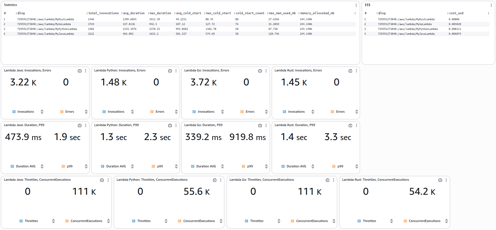
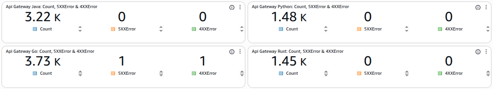
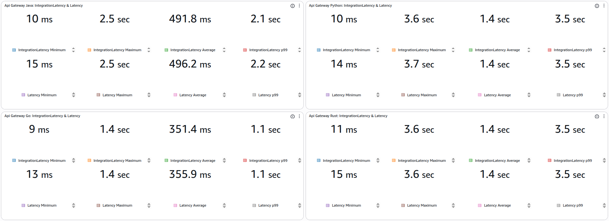

# AWS Lambdas Benchmark Project

Este repositório contém um projeto completo para comparar o desempenho de AWS Lambdas implementadas em **Java (Quarkus)**, **Python**, **Go** e **Rust**. O projeto inclui a infraestrutura como código (Terraform), o código fonte das funções e uma ferramenta de benchmark.

## Estrutura do Projeto

A estrutura de diretórios é organizada da seguinte forma:

```
/
├── benchmark/      # Ferramenta de teste de carga escrita em Go
├── go/             # Implementação da Lambda em Go
├── infra/          # Infraestrutura como código (Terraform)
├── java/           # Implementação da Lambda em Java (Quarkus)
├── python/         # Implementação da Lambda em Python
├── rust/           # Implementação da Lambda em Rust
└── README.md       # Documentação do projeto
```

---

## 1. Java (Quarkus)

A implementação Java utiliza o framework **Quarkus** para otimizar o tempo de inicialização e consumo de memória, ideal para ambientes Serverless.

*   **Localização:** `/java`
*   **Framework:** Quarkus 3.15.1
*   **Java Version:** 21
*   **Build Tool:** Maven

---

## 2. Python

A implementação Python é uma função Lambda padrão, utilizando bibliotecas leves para manter o cold start baixo.

*   **Localização:** `/python`
*   **Runtime:** Python 3.12
*   **Principais Dependências (`requirements.txt`):**
    *   `boto3`: SDK da AWS para interagir com DynamoDB.
    *   `PyJWT`: Manipulação de tokens JWT.
    *   `bcrypt`: Hashing de senhas.

---

## 3. Go

A implementação em Go é compilada para um binário nativo e executada no runtime `provided.al2`.

*   **Localização:** `/go`
*   **Runtime:** `provided.al2`
*   **Build:** O binário é compilado estaticamente com `CGO_ENABLED=0` para evitar problemas de compatibilidade com a `glibc`.
*   **Principais Dependências:**
    *   `github.com/aws/aws-lambda-go`: Runtime da AWS Lambda.
    *   `github.com/aws/aws-sdk-go`: SDK da AWS.
    *   `github.com/golang-jwt/jwt/v5`: Manipulação de JWT.
    *   `golang.org/x/crypto/bcrypt`: Hashing de senhas.

---

## 4. Rust

A implementação em Rust também é compilada para um binário nativo estático, visando máxima performance e segurança.

*   **Localização:** `/rust`
*   **Runtime:** `provided.al2`
*   **Build:** O binário é compilado para o target `x86_64-unknown-linux-musl` para garantir compatibilidade com o ambiente Lambda. O build é feito via Docker para não depender de ferramentas no host.
*   **Principais Dependências:**
    *   `lambda_runtime`: Runtime da AWS Lambda.
    *   `aws-sdk-dynamodb`: SDK da AWS.
    *   `jsonwebtoken`: Manipulação de JWT.
    *   `bcrypt`: Hashing de senhas.
    *   `tokio`: Runtime assíncrono.

---

## 5. Infraestrutura (Terraform)

A infraestrutura é provisionada utilizando **Terraform**, garantindo reprodutibilidade e gerenciamento de estado.

*   **Localização:** `/infra/terraform`
*   **Provider:** AWS (~> 5.0)
*   **Região:** `us-east-1`

### Módulos
*   `modules/dynamodb`: Criação das tabelas DynamoDB.
*   `modules/lambda-java`: Provisionamento da Lambda Java.
*   `modules/lambda-python`: Provisionamento da Lambda Python.
*   `modules/lambda-go`: Provisionamento da Lambda Go.
*   `modules/lambda-rust`: Provisionamento da Lambda Rust.
*   `modules/api-gateway`: Configuração do API Gateway para expor as Lambdas.

### Ambientes
*   `envs/dev`: Configuração específica para o ambiente de desenvolvimento.

---

## 6. Benchmark (Go)

Uma ferramenta personalizada escrita em **Go** para executar testes de carga e comparar o desempenho das implementações.

*   **Localização:** `/benchmark`
*   **Linguagem:** Go
*   **Arquivo Principal:** `main.go`

### Como Executar
1.  Certifique-se de ter Go instalado.
2.  Navegue até a pasta `benchmark`.
3.  Configure as variáveis de ambiente ou edite as constantes de URL e API Key no arquivo `main.go` com os valores do seu ambiente implantado (obtidos dos outputs do Terraform).
4.  Execute:
    ```bash
    go run main.go
    ```

---

## 7. Resultados do Benchmark (CloudWatch)

Abaixo estão os resultados detalhados coletados via CloudWatch Dashboard para uma execução de teste comparando as quatro implementações.





### Lambda Metrics

#### 1. Statistics (Invocations, Duration, Cold Start, Memory)
Comparativo geral de invocações, duração média/máxima, cold starts e uso de memória.

| Metric | Go | Java | Python | Rust |
| :--- | :--- | :--- | :--- | :--- |
| **Total Invocations** | 3724 | 3222 | 1482 | 1446 |
| **Avg Duration (ms)** | 337.01 | 466.09 | 1343.40 | 1399.60 |
| **Max Duration (ms)** | 942.50 | 1652.20 | 2378.25 | 3411.59 |
| **Avg Cold Start (ms)** | 107.12 | 501.53 | 993.86 | 49.23 |
| **Max Cold Start (ms)** | 127.72 | 574.69 | 1102.78 | 88.76 |
| **Cold Start Count** | 76 | 50 | 50 | 80 |
| **Max Mem Used (MB)** | 35.29 | 128.75 | 87.74 | 27.66 |
| **Allocated Mem (MB)** | 244.14 | 244.14 | 244.14 | 244.14 |

#### 2. Invocations & Errors
Volume de invocações e erros registrados.

| Function | Invocations | Errors |
| :--- | :--- | :--- |
| **Go** | 3724 | 0 |
| **Java** | 3222 | 0 |
| **Python** | 1482 | 0 |
| **Rust** | 1446 | 0 |

#### 3. Duration & P99
Comparativo de duração média e percentil 99 (P99).

| Function | Duration AVG (ms) | P99 (ms) |
| :--- | :--- | :--- |
| **Go** | 339.20 | 919.78 |
| **Java** | 473.87 | 1916.57 |
| **Python** | 1343.40 | 2262.23 |
| **Rust** | 1402.33 | 3265.84 |

#### 4. Throttles & Concurrent Executions
Monitoramento de throttling e execuções concorrentes.

| Function | Throttles | Concurrent Executions |
| :--- | :--- | :--- |
| **Go** | 0 | 110932 |
| **Java** | 0 | 110755 |
| **Python** | 0 | 55636 |
| **Rust** | 0 | 54232 |

#### 5. Estimated Cost (USD)
Custo estimado baseado na duração cobrada e memória alocada.

| Function | Cost (USD) |
| :--- | :--- |
| **Go** | $0.005028 |
| **Java** | $0.006074 |
| **Rust** | $0.008060 |
| **Python** | $0.008111 |

### API Gateway Metrics

#### 1. Count, 5XX & 4XX Errors
Volume de requisições e erros no API Gateway.

| API | Count | 5XX Error | 4XX Error |
| :--- | :--- | :--- | :--- |
| **Go** | 3725 | 1 | 1 |
| **Java** | 3222 | 0 | 0 |
| **Python** | 1482 | 0 | 0 |
| **Rust** | 1447 | 0 | 0 |

#### 2. Integration Latency & Latency
Latência total e de integração para cada stack.

| API | Metric | Min (ms) | Max (ms) | Avg (ms) | P99 (ms) |
| :--- | :--- | :--- | :--- | :--- | :--- |
| **Go** | Integration Latency | 9 | 1356 | 351.45 | 1071.38 |
| | Total Latency | 13 | 1363 | 355.93 | 1071.92 |
| **Java** | Integration Latency | 10 | 2461 | 491.78 | 2146.50 |
| | Total Latency | 15 | 2465 | 496.25 | 2150.87 |
| **Python** | Integration Latency | 10 | 3648 | 1390.98 | 3514.14 |
| | Total Latency | 14 | 3654 | 1395.68 | 3514.14 |
| **Rust** | Integration Latency | 11 | 3587 | 1418.66 | 3519.75 |
| | Total Latency | 15 | 3591 | 1423.54 | 3522.79 |

---

## 8. Conclusão e Comparativo Final

Com base nos dados coletados, podemos fazer uma análise detalhada entre as quatro implementações:

### Desempenho (Latência e Throughput)
*   **Go** foi o grande vencedor em termos de desempenho bruto.
    *   **Duração Média:** ~337ms, sendo o mais rápido de todos.
    *   **Throughput:** Processou o maior número de invocações (3724), demonstrando excelente capacidade de vazão.
    *   **Latência P99:** Manteve a latência de cauda (P99) em ~920ms, significativamente menor que os outros.
*   **Java (Quarkus)** ficou em segundo lugar, com desempenho muito sólido.
    *   **Duração Média:** ~466ms.
    *   **Throughput:** 3222 invocações, próximo ao Go.
*   **Rust** e **Python** tiveram desempenhos similares em duração média (~1400ms), o que é inesperado para Rust. Isso pode indicar alguma ineficiência na implementação específica ou overhead em bibliotecas utilizadas (como bcrypt/argon2) que podem não estar otimizadas para o ambiente Lambda como em Go/Java.

### Cold Start
*   **Rust** teve o menor cold start médio (~49ms) e máximo (~88ms), mostrando a eficiência do binário nativo pequeno.
*   **Go** também teve cold starts excelentes (~107ms).
*   **Java (Quarkus)** teve cold starts moderados (~500ms), o que é ótimo para Java.
*   **Python** teve os maiores cold starts (~993ms).

### Consumo de Recursos
*   **Rust** foi o mais eficiente em memória (~27MB).
*   **Go** também foi muito eficiente (~35MB).
*   **Python** consumiu ~87MB.
*   **Java** consumiu mais memória (~128MB), como esperado da JVM, mas ainda dentro de limites muito razoáveis.

### Custo
*   **Go** foi a opção mais barata ($0.0050), seguido de perto pelo **Java** ($0.0060).
*   **Rust** e **Python** foram os mais caros (~$0.0080) devido ao maior tempo de execução médio neste teste específico.

### Veredito

*   **Go:** A melhor escolha geral para este cenário. Combinou o maior throughput, menor latência média e menor custo.
*   **Java (Quarkus):** Uma excelente alternativa, especialmente para times já familiarizados com o ecossistema Java. O Quarkus cumpre a promessa de tornar Java viável e eficiente para Serverless.
*   **Rust:** Campeão em eficiência de memória e cold start. O tempo de execução médio alto merece investigação (possivelmente otimização de código ou bibliotecas), pois a linguagem tem potencial para competir com ou superar Go.
*   **Python:** A opção mais lenta e com maior cold start neste benchmark, embora seja a mais fácil de implementar.
